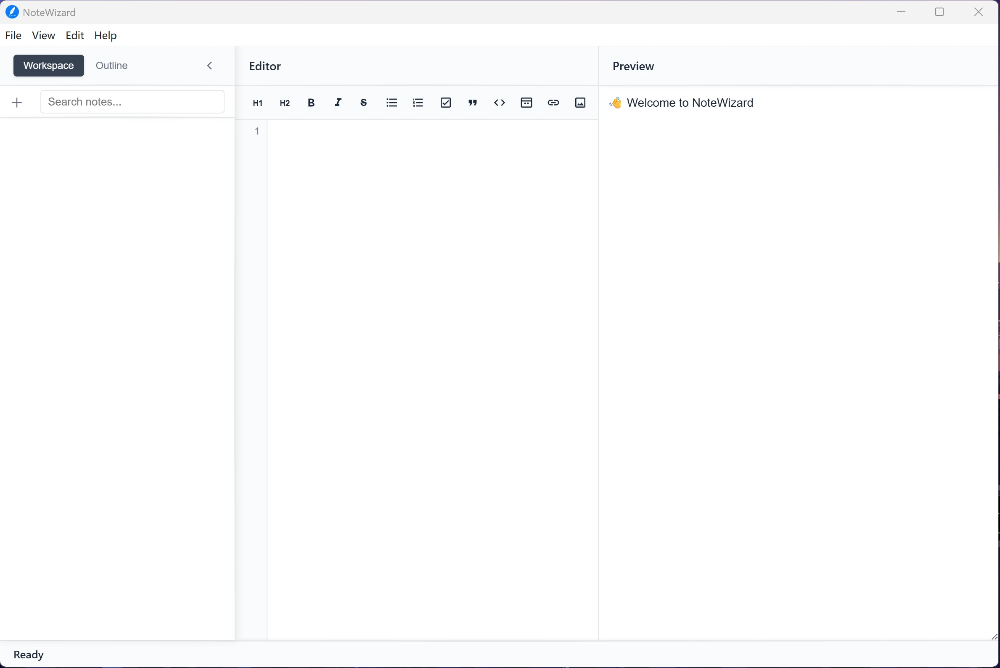

**Language / 语言:** [English](README.md) | [简体中文](README_CN.md)

  
  <h2> NoteWizard </h2>
  
A modern cross-platform note-taking desktop application built with Electron, featuring local data storage for complete security and control.

  

## Features
- **Minimalist Interface**: Simple, pure, and ad-free
- **Cross-Platform**: Supports Windows, macOS, and Linux
- **Easy Migration**: Supports complete NoteWizard proprietary format (.nwp) for full import/export, as well as Markdown (.md) format import/export
- **Local Encrypted Storage**: All note data can be encrypte(AES-256-GCM algorithm) and stored under the user's local control.
- **Markdown Support**: Real-time preview of Markdown rendering
- **AI-Powered Writing Assistant**: AI-powered writing assistance to make your writing easier (Off by default)
- **Internationalization**: Supports 19 languages and regional settings worldwide

## Screenshots
**NoteWizard Quick Start**  
> Tips: software is continuously updated to enhance performance and user experience. Listed features are for reference only and may evolve with technological advancements and user needs.

## Supported Platforms

Current supported operating systems and architectures:
| Platform | Supported Versions | Architecture | Package Format | Notes |
|----------|-------------------|--------------|----------------|-------|
| **Windows** | Windows 10 and above | x64 | `.exe` | Windows XP ~ 8.1 not supported |
| **macOS** | macOS Big Sur (11.0) and above | x64 / arm64 | `.dmg`, `.zip` | Supports Intel and Apple Silicon |
| **Linux** | Ubuntu 18.04 / Debian 10 / Fedora 32 and above | x64 | `.deb`, `.rpm`, `.AppImage` | Compatible with mainstream Linux distributions |

>  **Note:** Please download the appropriate package for your platform and ensure your system meets the minimum version requirements.

## Download & Installation
Built automatically using `Workflows`, click to download the latest package for your platform:

### Windows

### macOS

**Intel Chip**

**Apple Silicon**

### Linux

**DEB Package (Debian/Ubuntu)**  

**RPM Package (Fedora/RHEL)**  

**AppImage (Universal)**  

>   [View All Releases](https://github.com/jetyu/NoteWizard/releases)

## Official Wiki

## License

This project is licensed under the MIT License. See the `LICENSE` file for details.

## Acknowledgments

Thanks to the following open source projects:
- [Electron](https://www.electronjs.org/)
- [CodeMirror](https://codemirror.net/)
- [markdown-it](https://github.com/markdown-it/markdown-it)

---

### Star History
  
