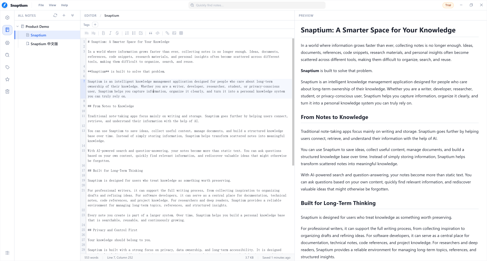

# Snaptium

<div align="center">

**Language / 语言：** [English](README.md) | [简体中文](README_CN.md)

</div>

<div align="center">
  

# Snaptium
**提示: NoteWizard 已全面升级为 Snaptium，如需使用 NoteWizard，请前往 [NoteWizard](https://github.com/jetyu/Snaptium/releases/tag/v1.2.1)
下载**

[官方网站](https://snaptium.com) [官方文档](https://snaptium.com/docs) [下载地址](https://snaptium.com/#download)

### 本地优先的 Markdown 智能写作与知识管理工作空间

一款基于 Electron + Vue 3 构建的现代化跨平台 Markdown 智能工作空间。  
专注于深度写作、知识管理与本地优先体验，支持 AI 辅助写作、知识库、端到端加密同步与多端协作。

[](https://github.com/jetyu/Snaptium/actions/workflows/build.yml)
[](https://github.com/jetyu/Snaptium/releases/latest)

[](https://github.com/jetyu/Snaptium/releases)


[]()
[]()
[]()

</div>

# ✨ 项目定位

Snaptium 并不仅仅是一款 Markdown 笔记工具。  
它更像是一个围绕「长期写作、知识沉淀与本地 AI 工作流」构建的智能写作空间。

项目强调：

- 本地优先（Local First）
- 数据自主可控
- 长期可持续存储
- AI 辅助而非 AI 绑定
- 可离线使用
- 多平台一致体验

---

# 🚀 核心特性

## 📝 Markdown 智能写作

- 基于 CodeMirror 的现代化编辑器
- 实时 Markdown 渲染预览
- 编辑器 / 预览同步滚动
- 数学公式（KaTeX）支持
- 代码高亮支持
- 任务列表 / 表格 / 脚注 / 标记语法支持
- 深色模式与沉浸式写作体验

---

## 🤖 AI 智能辅助

支持接入多种 AI 服务，用于：

- AI 辅助写作
- 内容润色
- 智能问答
- 文档总结
- 知识库问答（RAG）
- 语义检索

支持自定义模型与 API：

- OpenAI
- OpenRouter
- DeepSeek
- Gemini
- Claude
- Ollama（本地模型）
- 兼容 OpenAI API 的第三方服务

> 默认情况下 AI 功能为关闭状态，所有 AI 能力由用户主动配置。

---

## 🔒 本地优先与隐私安全

Snaptium 采用 Local First 架构设计：

- 默认本地存储
- 不强制登录
- 不依赖中心化服务器
- 用户完全掌控数据

支持：

- AES-256-GCM 本地加密
- Workspace Password 工作区密码
- Recovery Key 恢复密钥
- 端到端加密同步（E2EE）
即使使用对象存储同步，云端也仅保存加密后的数据。

---

## ☁️ 云同步支持

支持多种同步方式：

- S3 Compatible Object Storage
- Cloudflare R2
- WebDAV
- MinIO
- NAS 私有存储

支持完全自托管与私有化同步。

---

## 🧠 本地知识库（RAG）

内置向量知识库能力：

- 文档切片（Chunk）
- 向量嵌入
- 语义检索
- 本地知识索引
- AI 基于知识库问答

项目已集成：

- LanceDB
- Apache Arrow

支持未来扩展本地 Embedding 模型与离线 AI 工作流。

---

## 🌍 国际化

支持18种多语言与地区设置。

目前已支持：

- 简体中文
- English
- 日本語
- 한국어
- Deutsch
- Français
- Español
- Русский
- 更多语言持续增加中...

---

# 🖼️ 界面预览

## 编辑模式



## 阅读模式


## 智能写作


## 知识库


---

# 🧩 技术栈

## 前端

- Vue 3
- TypeScript
- Vite
- Pinia
- Vue I18n
- CodeMirror 6

## 桌面端

- Electron
- Electron Builder
- Electron Updater

## Markdown 生态

- markdown-it
- KaTeX
- highlight.js

## AI / 数据能力

- LanceDB
- Apache Arrow
- AWS SDK S3
- WebDAV

---

# 💻 支持平台

| 操作系统 | 支持版本 | 架构 | 安装包格式 |
|------|------|------|------|
| Windows | Windows 10 及以上 | x64 | `.exe` |
| macOS | macOS 11+ | x64 / arm64 | `.dmg` `.zip` |
| Linux | Ubuntu / Debian / Fedora 等主流发行版 | x64 | `.deb` `.rpm` `.AppImage` |

> 请根据对应平台下载适合的安装包。

---

# 📦 下载

## Windows

[](https://github.com/jetyu/Snaptium/releases/latest/download/Snaptium-Windows-x64.exe)

---

## macOS

### Intel Chip

[](https://github.com/jetyu/Snaptium/releases/latest/download/Snaptium-macOS-x64.dmg)

[](https://github.com/jetyu/Snaptium/releases/latest/download/Snaptium-macOS-x64.zip)

### Apple Silicon

[](https://github.com/jetyu/Snaptium/releases/latest/download/Snaptium-macOS-arm64.dmg)

[](https://github.com/jetyu/Snaptium/releases/latest/download/Snaptium-macOS-arm64.zip)

---

## Linux

### Debian / Ubuntu

[](https://github.com/jetyu/Snaptium/releases/latest/download/Snaptium-Linux-x64.deb)

### Fedora / RHEL

[](https://github.com/jetyu/Snaptium/releases/latest/download/Snaptium-Linux-x64.rpm)

### AppImage

[](https://github.com/jetyu/Snaptium/releases/latest/download/Snaptium-Linux-x64.AppImage)

---

> [查看全部版本](https://github.com/jetyu/Snaptium/releases)

---

# 🛠️ 本地开发

## 安装依赖

```bash
npm install
```

## 启动开发环境

```bash
npm run dev
```

## 构建应用

```bash
npm run dist
```

---

# 📚 文档与 Wiki

- Wiki：https://github.com/jetyu/Snaptium/wiki
- Docs：https://github.com/jetyu/Snaptium/tree/feature/snaptive/docs

---

# 📌 项目路线

未来计划包括：

- 本地 AI 模型集成
- AI Agent 工作流
- 多工作区管理
- 协作编辑
- 插件系统
- 移动端支持
- 更完整的离线知识库能力

---

# 📄 开源协议

本项目采用 Apache License 2.0 开源协议。

详情请参阅：

```text
LICENSE
```

---

# ❤️ 致谢

感谢以下优秀开源项目：

- Electron
- Vue
- CodeMirror
- markdown-it
- KaTeX
- LanceDB
- Apache Arrow

以及所有为 Snaptium 提交 Issue、PR 与建议的开发者与用户。

特别感谢 [Linux.do 社区](https://linux.do/) 为开发者提供了一个开放、友好的交流空间，也感谢社区成员对 Snaptium 的支持、反馈与鼓励。

---

# ⭐ Star History

[](https://star-history.com/#jetyu/Snaptium&Date)

