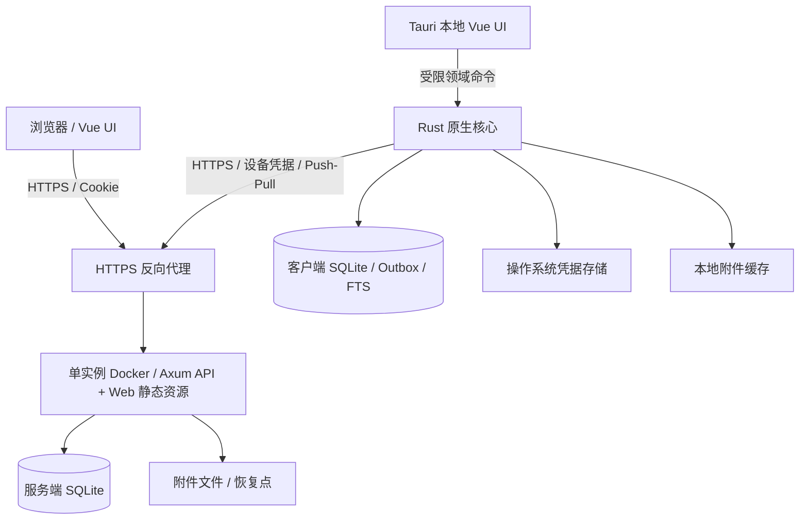
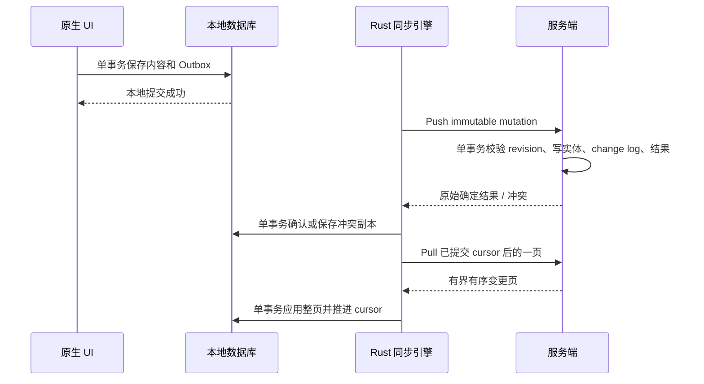

# 技术架构

本文依据 [OpenSpec 变更](../openspec/changes/add-self-hosted-notes-platform/proposal.md)、[设计](../openspec/changes/add-self-hosted-notes-platform/design.md)、六项能力规范及 [任务清单](../openspec/changes/add-self-hosted-notes-platform/tasks.md)编写。项目已开始 Web-first 基础实施，本文描述完整目标架构，不代表全部功能已实现；实际交付状态见 [本地开发与验证](development.md)。

OpenSpec 定义产品行为和架构决策，本文提供工程落地说明；出现冲突时先修订并评审 OpenSpec。下文标记为“建议”的目录、工具及实现细节需在对应任务中落实；待决策项不能作为已确定产品承诺。

## 1. 范围和信任模型

首发面向个人、家庭与可信小群体的单节点自托管场景。Docker 同时提供 Web 与 API；Windows 原生客户端支持离线操作。各账号数据隔离，小群体部署不代表共享笔记或协作编辑。

- Web 在线优先，仅恢复未提交草稿、偏好和临时上传状态。
- Windows 使用 Tauri 2，复用 Vue UI，通过 Rust 实现本地持久化和同步。
- Markdown 是存储、同步和导出的规范内容格式，富文本编辑器只是其交互投影。
- 不包含 E2EE、协作、CRDT、完整 Web 离线副本、PostgreSQL、横向扩容或其他平台正式发行。
- 服务管理员属于可信主体，可访问服务端内容；HTTPS、鉴权、授权与备份保护仍然必须落实。
- 不恢复旧 Electron 应用；定向迁移必须另有经过评审的 OpenSpec 变更。

## 2. 系统组成



服务端数据库是已提交共享状态的权威来源；原生数据库保存本地可用内容和待提交操作。两者通过协议交换实体，绝不交换数据库文件。WebView 只加载随安装包交付的本地 UI，服务器地址仅用于数据通信。

| 层 | 技术与职责 | 边界 |
| --- | --- | --- |
| 共享界面 | Vue 3、严格 TypeScript、共享 UI 与 i18n | 不直接依赖数据库或凭据存储 |
| 编辑器 | Milkdown / ProseMirror、受控 Markdown 子集 | 不将编辑器 JSON 作为权威内容 |
| Web 适配器 | HTTP API、IndexedDB 草稿 | 不承担原生离线同步引擎 |
| 原生壳 | Tauri 2、窗口生命周期、最小权限配置 | 不开放通用 SQL、文件系统或 shell |
| 原生核心 | Rust、本地仓储、Outbox、同步、FTS | 不依赖服务端仓储与迁移 |
| 服务端 | Rust、Axum、认证、用例、仓储 | 每个数据操作验证所有权 |
| 服务端持久层 | SQLite、附件文件、备份协调 | 单活实例，不依赖外部数据库或对象存储 |
| 共享契约 | Rust 领域基础类型、Wire DTO、协议夹具 | 不共享数据库行模型 |

## 3. 仓库布局和依赖方向

已确定按平台划分应用目录，以下完整布局在任务 2.1、2.2 中逐步搭建；Web、服务端入口及部分共享包已有基础代码，尚未建立的模块按对应任务创建。

```text
apps/
  web/                    Web 入口与 HTTP 适配器
  windows/                Windows Vue 入口及 src-tauri 壳
  server/                 Axum、服务端用例、仓储及迁移
packages/
  ui/                     共享工作区组件
  editor/                 Markdown 编辑与序列化
  i18n/                   文案资源
  contracts/              生成的 TS 契约及运行时校验
crates/
  domain/                 纯领域基础类型与规则
  protocol/               Wire DTO 与协议版本
  native-core/            本地仓储、同步、凭据与文件适配器
tests/                    协议、跨客户端和故障场景
deploy/
  docker/                 Dockerfile、Compose、代理与部署配置
docs/                     工程与运维文档
```

`apps/windows/` 只承载 Windows 入口、Tauri 配置及平台专属适配，UI、编辑器与存储/同步核心分别复用 `packages/` 和 `crates/native-core/`。服务端 Rust crate 位于 `apps/server/`，Windows 壳 crate 位于 `apps/windows/src-tauri/`，二者与 `crates/` 下共享 crate 一同纳入根 Cargo workspace；不得额外复制一份 `crates/server/`。Docker 是 Web 与服务端的部署方式，不作为独立客户端。未来正式支持 Android、macOS、Linux 或 iOS 时，再增加对应小写平台目录；Android 风险验证不等于正式客户端交付。

界面通过领域操作接口访问 Web 或原生适配器；HTTP handler 与 Tauri command 只负责校验、上下文建立、用例调用与错误转换。业务事务在用例/仓储层完成。领域层不依赖 Axum、Tauri 或 SQL；服务端与原生端只能向共享契约依赖，不能相互导入内部实现。抽象以已有用例为依据，不预建微服务、插件框架或通用数据库平台。

建议使用 Cargo workspace 与 pnpm workspace 管理 Rust、前端依赖，工具链版本和锁文件在脚手架任务中确定并固定。契约生成方式需在任务 3.2–3.5 中选定，保证 Rust DTO、OpenAPI、TypeScript 和运行时校验一致，避免重复手工维护。

## 4. 领域和存储设计

领域包括账号、设备、会话、笔记、组织结构、附件、修订、变更流、冲突、导出与备份。用户已于 2026-10-05 确认首版采用文件夹，标签延后，不提前增加标签表、API 或 UI。文件夹与笔记移动必须验证同一 owner；层级及删除行为在实现相应操作前明确，不得默默删除笔记内容。任务 1.2 的其余容量和保留策略仍待确认。

服务端分别管理账号/会话、内容实体、附件元数据、修订历史、mutation 结果和按用户排序的 change log。原生端分别管理本地实体、服务器基线、不可变 Outbox、同步游标、冲突副本、附件传输状态、FTS 与设置。数据库行映射为领域或 Wire 类型后才可跨模块边界传递。

SQLite 每个连接启用外键，使用 WAL、有限连接池、busy timeout 与短写事务；生产持久化配置需根据断电恢复目标明确 `synchronous` 策略。同步网络请求、密码哈希和附件复制不在数据库写事务内执行。进程在迁移和写入前取得数据目录的排他所有权；仅依赖 SQLite 写锁不足以实现单实例启动约束。WAL 文件位于支持其锁语义的本地持久磁盘，不把网络共享目录作为默认部署方式。参见 [SQLite WAL 文档](https://www.sqlite.org/wal.html)。

数据库约束覆盖唯一性、外键、实体归属和合法状态；SQL 参数化，查询包含 owner 条件。FTS 是可重建的派生索引，不能替代 Markdown 主数据。

## 5. API 和契约

同源路由使用 `/`、`/assets`、`/.well-known/notes`、`/api/v1` 和 `/ws`。API 与静态资源错误不能被 SPA fallback 转为 HTML 成功响应。健康端点路径在任务 12.3 中确定。

- 实体和 mutation 使用 UUIDv7；时间使用 RFC 3339，并统一 UTC 编码。
- revision 与 cursor 使用字符串编码，避免 JavaScript 整数精度丢失；排序语义由协议定义，不按十进制字符串字典序比较。
- revision 表示实体版本，cursor 表示用户变更流位置，不能互相替代，也不以设备时间判定覆盖关系。
- API、同步协议、WebSocket 通知、Markdown 格式、两端数据库 schema 和备份 manifest 分别版本化。
- 列表、pull、请求体、导入文件及上传均设置大小、数量与超时上限；具体值由任务 1.2 决定。
- 错误包含稳定机器码、关联请求标识和受控详情；用户文案由客户端 i18n 映射，响应不携带 SQL、文件绝对路径或堆栈。
- 相邻受支持版本通过 golden JSON 与兼容性测试验证；不支持版本在写入前拒绝。新可选字段保持兼容，未知操作显式拒绝，不能忽略后推进游标。
- WebSocket 仅发出变更可用通知与 cursor 提示；客户端通过 HTTP pull 获取权威内容，断线或漏通知通过重新 pull 恢复。

## 6. 同步和数据安全不变量



必须保持以下不变量：

1. UI 宣告原生“已保存”之前，内容和对应 Outbox 已一并持久化；“已保存本地”和“已同步”分别呈现。
2. mutation 提交后不可修改 ID、操作、base revision 或 payload。服务端按用户/设备授权域检查幂等身份，对同 ID 不同载荷明确报错；相同请求返回原始结果，不重复增加 revision。
3. 实体、revision、change log 和接受结果在同一事务内提交；冲突等确定拒绝结果也需可重复获取。瞬时网络/存储失败不能伪装成最终业务结果。
4. 同一实体连续离线编辑必须定义依赖链：先确认前一操作，再构造下一项可提交 mutation；不得把多次编辑都绑定同一旧 revision。待处理编辑和基线分开保存，不能原地改写已提交 mutation。
5. Pull 应用不能覆盖尚未确认的本地编辑；区分服务器基线和本地工作内容。确认结果更新、Outbox 状态与必要冲突记录以事务完成，失败后可重试。
6. 一页变更与新 cursor 同事务提交。失败回滚整页，重启从上次提交位置继续。排序、分页上界和快照边界必须在协议任务中定义，保证无跳项。
7. 旧 revision 被拒绝时保留本地 Markdown 和服务器版本，创建可见冲突副本；编辑对删除、删除对编辑等竞争也须覆盖。Web 发生冲突时保留草稿供用户处理。
8. 网络失败以稳定 mutation ID、指数退避与抖动重试；认证撤销暂停同步并保留未提交数据。每个账号/服务器配置限制一个同步执行器，避免调度竞争。
9. Tombstone 与幂等结果保留期限须匹配支持的离线和重试窗口。游标过期不能返回空成功或默默丢数据；在任务 8.4 中定义重新初始化路径，并先保护本地未同步编辑。
10. 首次同步、恢复备份后的旧设备重连及变更流重置都必须识别基线失效；建议在协议中引入服务实例/流代际标识，具体字段与重建流程需经任务 3、8 评审确定。

## 7. Markdown 和附件

规范 Markdown 子集包含段落、标题、强调、删除线、列表与任务列表、引用、代码、链接、图片和分隔线。规范化应幂等，不能因跨端往返持续改写；通过中文、代码块、嵌套列表、转义和链接 fixtures 验证语义等价。不支持的语法保留原文或明确拒绝，不能无提示丢失。

Markdown 渲染和导入均校验 URL scheme、HTML 和活动内容；CSP 作为附加防线。远程图片是否默认加载及隐私行为须在编辑器任务中明确；服务端不能随意代理不可信 URL。

附件采用不透明 ID 与内部路径，原始文件名仅为显示元数据。上传先写临时文件、校验大小/类型/哈希，再原子发布文件并提交可用元数据；失败产生的孤立文件由可恢复清理流程处理。文件系统与 SQLite 不具备共同事务，因此必须定义暂存、可用、删除待清理等状态及重启恢复机制。笔记提交不得引用尚不可用的服务端附件。原生附件在离线时区分本地可用、待上传、远端未缓存和失败状态。

下载与关联同样验证 owner；不把附件目录作为公开静态目录。禁止路径穿越、符号链接逃逸和可执行内联内容。清理不得移除仍被笔记、保留历史或进行中备份引用的文件。

## 8. 安全边界

Web 使用 Secure、HttpOnly、SameSite Cookie；所有写请求实施 CSRF 防护与 Origin 检查，登录流程也需纳入评审。SameSite 是纵深防御，不能替代 CSRF 校验，参见 [OWASP CSRF 指南](https://cheatsheetseries.owasp.org/cheatsheets/Cross-Site_Request_Forgery_Prevention_Cheat_Sheet.html)。

原生使用短期访问凭据和设备级可撤销的轮换刷新凭据；刷新凭据在服务端仅存哈希，在客户端使用 OS 保护存储。Rust 管理凭据，WebView 不持有刷新凭据。刷新重放、并发刷新、轮换响应丢失与撤销后的访问凭据失效必须有明确策略和测试。

密码使用 Argon2id，保存参数版本，登录后可按策略升级哈希。参数依照部署硬件测量和 [OWASP 密码存储指南](https://cheatsheetseries.owasp.org/cheatsheets/Password_Storage_Cheat_Sheet.html)确定，限制哈希任务并发以控制资源耗尽。

首次管理员初始化验证初始化权限并在事务内永久关闭入口。管理接口单独授权；管理员角色不自动获得普通账号笔记 API 的跨用户访问权。登录、初始化、导出和上传等敏感入口采用有界资源和限流。跨账号 ID 使用统一失败行为避免存在性泄露。

Tauri 使用按窗口配置的最小 capabilities，并对自定义 commands 显式限制调用权限；Rust 再次检查参数与账号/服务器上下文，不能把 capability 当作业务授权。参见 [Tauri Runtime Authority](https://v2.tauri.app/security/runtime-authority/)。文件选择授权不等于允许任意路径；服务地址和重定向必须验证，不能跨服务器转发凭据或绕过 TLS 错误。

## 9. 备份、恢复与运维

建议持久卷分离数据库、附件和恢复点目录；实际路径在部署任务中确定。服务以非 root 运行，镜像内文件系统只读，必要的临时目录与持久卷显式声明。多阶段构建将 Web 与 API 打入同一版本镜像；默认 Compose 仅有应用与持久卷，外部代理终止 HTTPS。

数据库备份使用 SQLite 一致性备份机制，不复制活动 `.db` 文件。数据库快照还不等于完整备份：必须协调附件发布和清理，确保快照所引用的不可变附件在复制期间可用；manifest 记录应用/schema/格式版本、文件清单及校验值，最后原子标记备份完成。备份包含敏感账号与设备信息，限制访问并推荐加密及异机保存。同卷恢复点不能替代灾难恢复备份。

恢复先在隔离位置校验归档路径、完整性、引用、数据库约束与版本兼容，再停止服务、取得单实例锁并替换活动数据；恢复失败保留原数据。恢复后的设备会话与同步基线处理必须纳入测试。

迁移只向前执行，先生成或验证恢复点；失败停止接收流量，禁止在部分兼容 schema 上继续。回滚同时恢复旧镜像和对应备份，不执行不安全的降级迁移。原生 schema 迁移同样需要可恢复路径。

健康检查区分进程存活与就绪；schema、存储或迁移不满足要求时不得 ready。日志和指标记录请求关联、耗时、数量、状态及错误码，不记录笔记正文、标题、文件名、Cookie、密码、令牌或凭据 URL。

## 10. 落地顺序和决策门槛

| 阶段 | OpenSpec 任务 | 验收重点 |
| --- | --- | --- |
| 产品与风险验证 | 1 | 编辑器往返、Windows 原生边界、配额及保留策略；Android 仅验证风险 |
| 工程与契约 | 2–3 | 工具链、严格类型、CI、协议和版本 fixtures |
| 服务端与 Web | 4–7 | 数据约束、鉴权、编辑草稿、附件与恶意输入 |
| 同步与 Windows | 8–10 | 幂等、冲突、崩溃恢复、离线编辑与跨端一致性 |
| 恢复与交付 | 11–14 | 备份恢复、迁移回滚、镜像/安装包、威胁与数据丢失评审 |

实现前仍须确定：产品名与稳定标识、文件夹层级及删除行为、附件和账号配额、tombstone/mutation/history 保留策略、注册默认策略、Windows 签名及分发渠道。首版组织方式已确定为文件夹，标签延后。性能预算依据目标硬件测量确定；不得以未经验证的吞吐或容量数字作为发布承诺。
